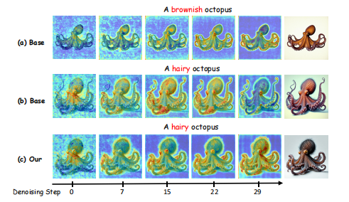
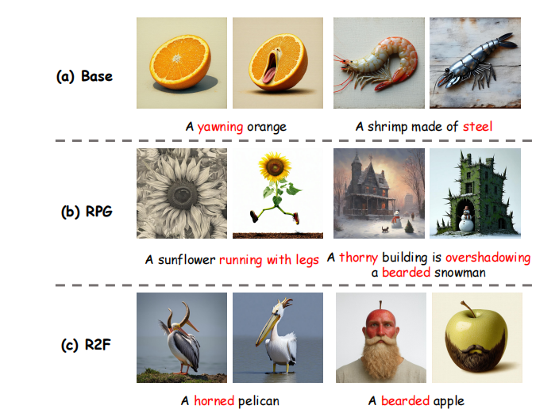
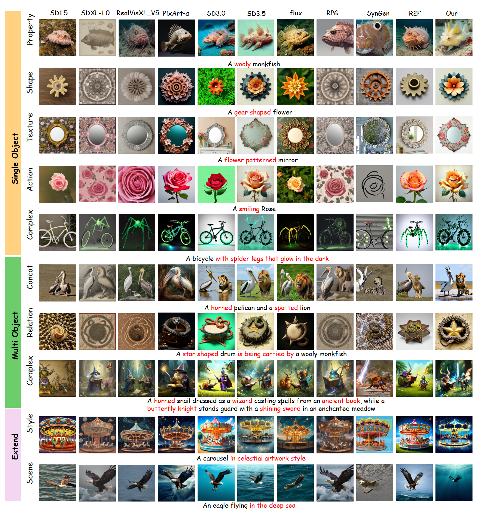
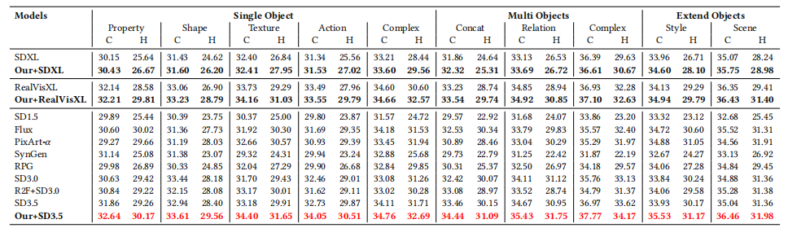
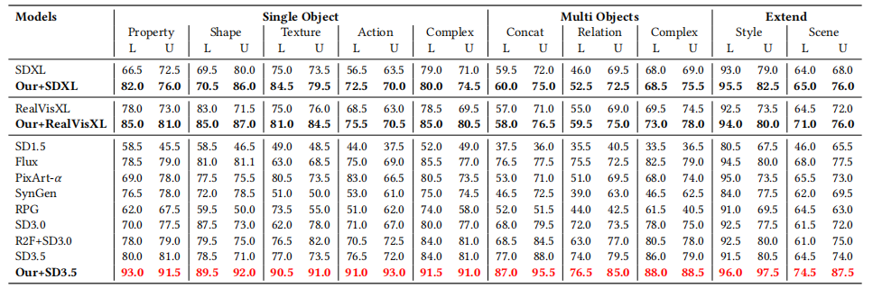
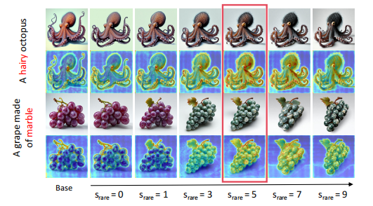
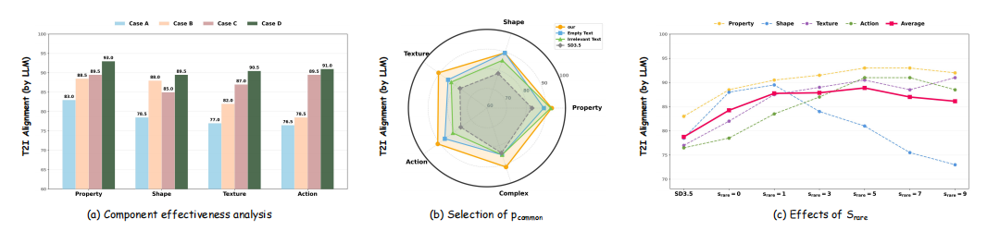

# CI-Diff
This repository is the official code for the paper "Rare Concept Generation via Counterfactual Inference in Diffusion Models" by Zhengyuan Jiang (2024110489@mail.hfut.edu.cn), Haipeng Liu(equal contribution: hpliu_hfut@hotmail.com), Meng Wang, Yang Wang(corresponding author: yangwang@hfut.edu.cn). ACM Multimedia 2026, Rio de Janeiro, Brazil.

# Motivation
Recent text-to-image diffusion models (SDXL, SD3.5, Flux, PixArt-α, etc.) achieve outstanding performance on common daily prompts, but they fail severely on rare concept generation tasks. Rare concept generation aims to synthesize images for creative prompts that describe objects with unusual attributes (e.g., a cheerleading toad, a bearded apple, a sunflower with walking legs). When handling such rare combinations, mainstream models frequently suffer two typical failures: missing atypical attributes and distorted object shapes.

- Limitations of Existing SOTA Methods
1. Pre-trained diffusion models are trained on massive conventional image-text datasets, where rare attribute-object combinations rarely appear. During training, the model builds strong fixed semantic bindings between entities and their frequent ordinary attributes. This inherent bias suppresses rendering of unusual features and prevents the model from breaking predefined common associations during sampling.


2. RPG relies on LLMs to decompose prompts, recaption sub-prompts and assign independent generation regions. However, it cannot eliminate the rigid semantic bindings between objects and standard attributes, and collapses when facing complex spatial overlapping entities.
3. R2F identifies rare attributes via LLMs and uses matched frequent concepts for progressive guidance. Unfortunately, the borrowed common concepts carry massive redundant irrelevant semantics, leading to severe object shape distortion in denoising steps.



# Inference
1.  Dataset Preparation: [Rarebench](https://github.com/krafton-ai/Rare-to-Frequent).
2.  Extend categories: Style categories See `datasets/single_6style.txt` folder and scen categories See `datasets/single_8scen.txt` folder.
3.  Pre-trained models: [stable-diffusion-3.5-large](https://huggingface.co/stabilityai/stable-diffusion-3.5-large); [ip-adapter.bin](https://huggingface.co/h94/IP-Adapter); [siglip-so400m-patch14-384](https://huggingface.co/google/siglip-so400m-patch14-384).
4.  Run the following command:
   ```bash
Python test.py
   ```
# Example Results
- Visual comparison between our method and the competitors.
  


- Quantitative results(C denotes CLIP-T score; H denotes HPSv2 score; L denotes LLM score and U denotes User Study)




- Ablation Studies



