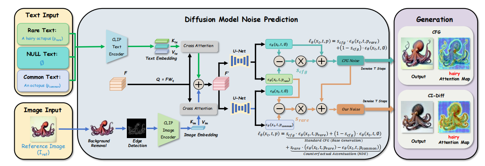

# CI-Diff
This repository is the official code for the paper "Rare Concept Generation via Counterfactual Inference in Diffusion Models" by Zhengyuan Jiang (2024110489@mail.hfut.edu.cn), Haipeng Liu(equal contribution: hpliu_hfut@hotmail.com), Meng Wang, Yang Wang(corresponding author: yangwang@hfut.edu.cn). ACM Multimedia 2026, Rio de Janeiro, Brazil.

# Motivation
Recent text-to-image diffusion models (SDXL, SD3.5, Flux, PixArt-α, etc.) achieve outstanding performance on common daily prompts, but they fail severely on rare concept generation tasks. Rare concept generation aims to synthesize images for creative prompts that describe objects with unusual attributes (e.g., a cheerleading toad, a bearded apple, a sunflower with walking legs). When handling such rare combinations, mainstream models frequently suffer two typical failures: missing atypical attributes and distorted object shapes.

- Limitations of Existing SOTA Methods
1. Pre-trained diffusion models are trained on massive conventional image-text datasets, where rare attribute-object combinations rarely appear. During training, the model builds strong fixed semantic bindings between entities and their frequent ordinary attributes. This inherent bias suppresses rendering of unusual features and prevents the model from breaking predefined common associations during sampling.
   


2. RPG relies on LLMs to decompose prompts, recaption sub-prompts and assign independent generation regions. However, it cannot eliminate the rigid semantic bindings between objects and standard attributes, and collapses when facing complex spatial overlapping entities.
3. R2F identifies rare attributes via LLMs and uses matched frequent concepts for progressive guidance. Unfortunately, the borrowed common concepts carry massive redundant irrelevant semantics, leading to severe object shape distortion in denoising steps.
   


To tackle all above challenges, we propose CI-Diff (Counterfactual Inference-based Diffusion): We construct a causal graph for text-to-image generation and leverage Natural Direct Effect (NDE) from counterfactual inference to eliminate the interference of common knowledge bias, then reformulate Classifier-Free Guidance (CFG) to decouple and amplify rare attributes in noise space. We design Temporal Morphological Fidelity Anchoring (TMFA), which injects background-removed edge priors within specific denoising timesteps to stabilize object structure while boosting the expression of unusual features. Extensive experiments on RareBench verify that our CI-Diff consistently outperforms all state-of-the-art diffusion models across alignment metrics, LLM evaluation and human user studies.

## Introduction

We are the first to introduce **counterfactual causal inference** into rare concept generation, and propose a training-free, plug-and-play framework named CI-Diff:

1. We construct the causal graph for text-to-image synthesis and utilize **Natural Direct Effect (NDE)** to block the mediation interference of common knowledge bias $K$, extracting the independent generation contribution of unusual attributes. The difference between NDE of rare prompt and corresponding subject-only common prompt isolates the pure causal effect of unusual attributes.

$$
NDE_{rare} = I_{p_{rare}, K_{p\ast}} - I_{p\ast, K_{p\ast}}
$$

$$
NDE_{common} = I_{p_{common}, K_{p\ast}} - I_{p\ast, K_{p\ast}}
$$

$$
NDE_{pure\_rare} = NDE_{rare} - NDE_{common}
$$

2. We parameterize NDE on Classifier-Free Guidance (CFG) and reformulate the final noise prediction function for denoising:

$$
\tilde{\epsilon}_{\theta}(x_t, t, c)
= s_{cfg} \cdot \epsilon_{\theta}(x_t, t, p_{rare}) + (1 - s_{cfg}) \cdot \epsilon_{\theta}(x_t, t, \emptyset) + s_{rare} \cdot ( \epsilon_{\theta}(x_t, t, p_{rare}) - \epsilon_{\theta}(x_t, t, p_{common}) )
$$


3. We design **Temporal Morphological Fidelity Anchoring (TMFA)** to inject background-removed edge maps within specific denoising timesteps to constrain object contours, resolving shape distortion caused by large $s_{rare}$:

$$
C_{\text{img}}(t) =
\begin{cases}
\text{Edge}\left( \text{RemoveBG}(I_{\text{ref}}) \right), & t \in [\tau_1 T, \tau_2 T] \\
0, & \text{otherwise}
\end{cases}
$$




# Inference
1.  Dataset Preparation: [Rarebench](https://github.com/krafton-ai/Rare-to-Frequent).
2.  Extend categories: Style categories See `datasets/single_6style.txt` folder and scen categories See `datasets/single_8scen.txt` folder.
3.  Pre-trained models: [stable-diffusion-3.5-large](https://huggingface.co/stabilityai/stable-diffusion-3.5-large); [ip-adapter.bin](https://huggingface.co/h94/IP-Adapter); [siglip-so400m-patch14-384](https://huggingface.co/google/siglip-so400m-patch14-384).
4.  Run the following command:
   ```bash
Python test.py
   ```
# Example Results
- Visual comparison between our method and the competitors.
  


- Quantitative results(C denotes CLIP-T score; H denotes HPSv2 score; L denotes LLM score and U denotes User Study)


- Ablation Studies


